# 一个简单的前后端分离案例


## 前言

在学习前端开发的过程中知了前后端分离这个概念
[前后分离架构的探索之路](https://segmentfault.com/a/1190000003795517)
[我们为什么要尝试前后端分离](https://segmentfault.com/a/1190000006240370)
因此决定小试身手,项目中主要使用到的框架和库.

> vuejs vue-router muse-ui axios express mongoose mongodb......

## 简介

一个前后端分离的案例,前端vuejs,后端express,数据库mongodb.
用express的提供api供前端调用,前端ajax请求进行对数据库的CURD操作.

## 效果图
首页
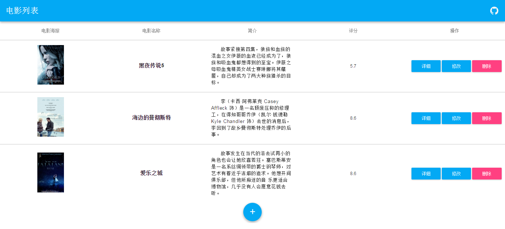
添加电影
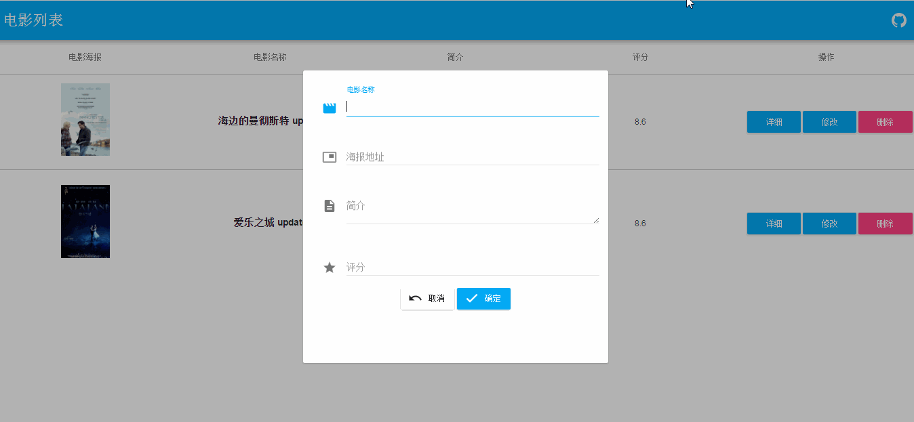
更新电影信息
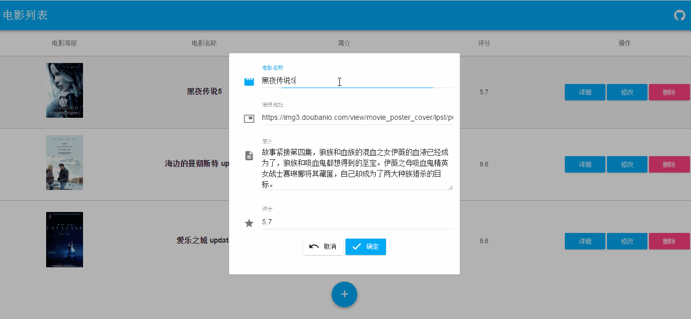
展示电影详情
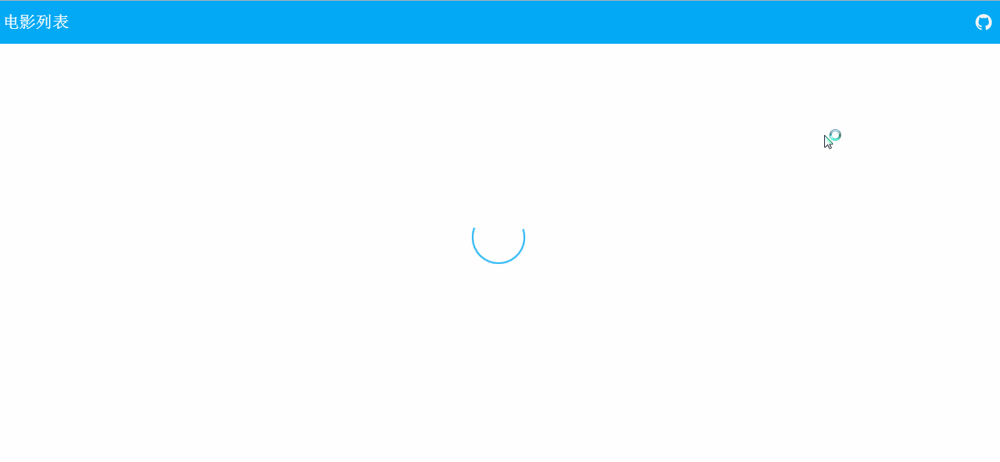
删除电影


## 开发环境
需要本地安装[node](https://nodejs.org/en/),[npm](https://www.npmjs.com/)或[yarn](https://yarnpkg.com/),[mongodb](https://www.mongodb.com/)

## 初始化
首先用vue-cli初始化项目目录
```bash
vue init webpack my-project

cd my-rpoject && npm install

npm run dev
```  
看到8080端口出现vuejs的欢迎界面表示成功    

接着把本地的mongodb服务跑起来,参考这篇[教程](https://segmentfault.com/a/1190000004868504)

## 后端开发
- 官方文档 [express](http://www.expressjs.com.cn/) [mongoose](http://mongoosejs.com/docs/guide.html)

首先把后端的服务搭好,方便以后前端调用,使用npm安装express,mongoose等必须的依赖即可,暂时不考虑验证等东西.
```bash
npm install express body-parser mongoose --save
```
然后在项目根目录添加一个app.js,编写好启动express服务器的代码
```
const express = require('express')
const app = express()
app.use('/',(req,res) => {
  res.send('Yo!')
})
app.listen(3000,() => {
    console.log('app listening on port 3000.')
})
```
使用nodemon或babel-watch,方便开发
```bash
npm install nodemon --save-dev

nodemon app.js
```

浏览器访问localhost:3000,出现res.send()的内容即表示成功.

然后添加需要的数据,新建一个models目录放数据模型,mongoose的每个数据model需要一个schema生成,

新建movie.js文件或者其他的数据模型,用来提供基础数据.

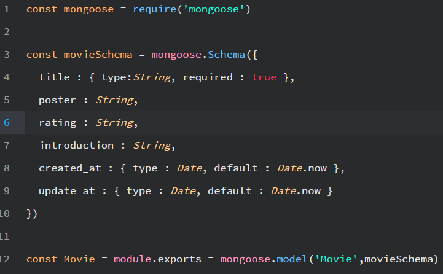

定义了title,poster,rating,introduction,created_at,update_at几个基本信息,最后将model导出即可.

接着用mongoose链接mongodb,在app.js里添加
```
const mongoose = require('mongoose')
mongoose.connect('mongodb://localhost:27017/yourDbName')
```

链接数据库成功后,可以用Robomongo可视化工具或者在CMD里输入mongo命令查看数据库.

接着将对数据CURD操作的几个路由写出来,新建router文件夹,新建index.js和movie.js分别对应首页路由,和对数据

操作的路由,如下.
- 首页路由  [index.js](./router/index.js)
- 对数据操作的路由  [movie.js](./router/movie.js)

最后将路由应用到app.js
```
......
const index = require('./router/index')
const movie = require('./router/movie')
......
app.use('/',index)
app.use('/api',movie)
......
```

使用Postman进行测试,测试成功的话,后端服务基本上就完成了.


## 前端开发
首先安装必要的依赖,看自己喜欢选择.
[muse-ui](https://museui.github.io/#/index) [axios](https://github.com/mzabriskie/axios)
```bash
npm install muse-ui axios --save
```
然后把不要的文件删除,在src/components目录新建主要的两个组件List,Detail.
List就是首页的列表,Detail是电影的详细数据,然后把前端路由写出来,在src/router建立前端路由文件,
只有两个组件之间切换,然后把<router-view></router-view>放到App.vue里面就可以了.

前端路由

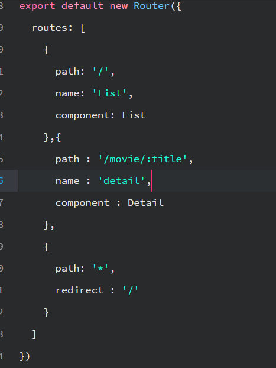

数据获取,由于我们的express是在3000端口启动的,而前端开发在8080端口,由于跨域所以要配置好vue-cli的proxyTable
选项,位于config/index.js,改写proxyTable.

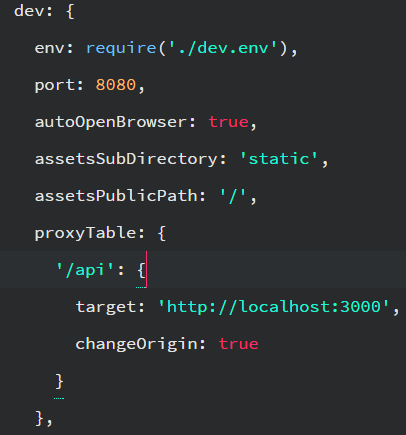

这样当在前端用axios访问 '/api' 的时候,就会被代理到 'http://localhost:3000/api',从而获得需要的数据.

能够获取到数据之后就是编写界面了,由于用了muse-ui组件库,所以只要按着文档写一般不会错,要是不满意就自己搭界面.

主要就是用ajax访问后端对数据增删改查的路由,将这些操作都写在组件的methods对象里面，写好主要的方法后，将方法

......

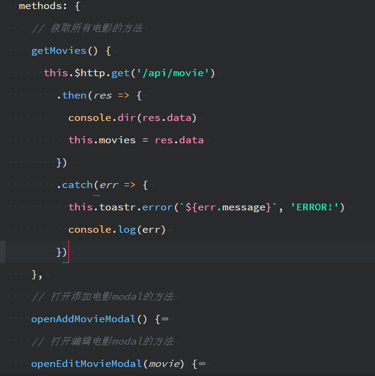
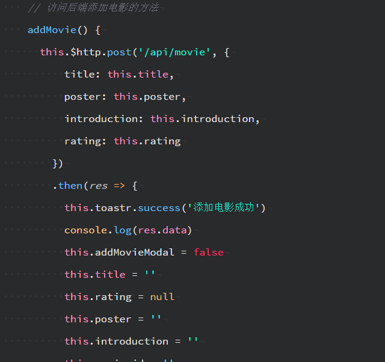

......

用vuejs里的写法,绑定到对应的按钮上
```
  @click="methodName"
```
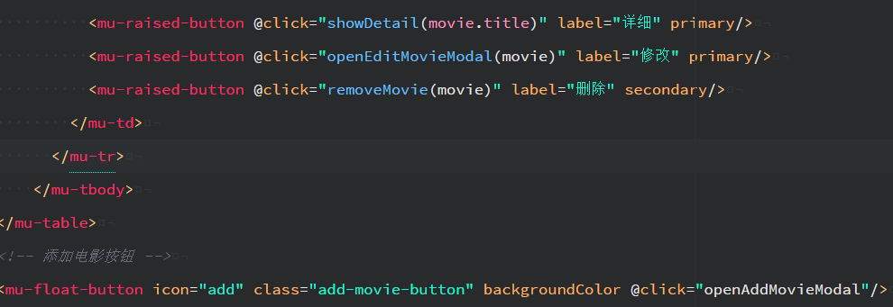

这样前端的开发就基本完成了.


## 结语

前端开发完成后,就可以用webpack打包了,注意将config/index.js文件里面的productionSourceMap设为false,
不然打包出来文件很大,最后用express.static中间件将webpack打包好的项目目录'dist'作为express静态文件服务的目录.

```bash
npm run build
```
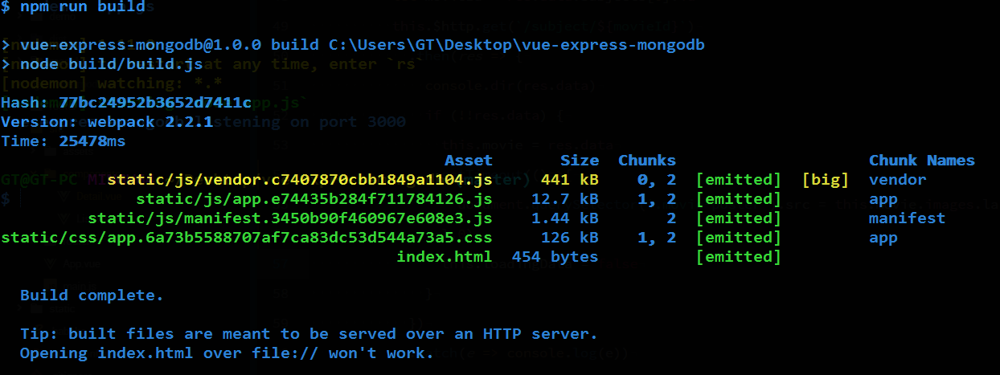

```
app.use(express.static('dist'))
```

最后案例完成后的目录结构就是这样.

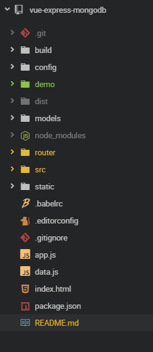


## Build Setup

``` bash
# install dependencies
npm install

# serve with hot reload at localhost:8080
npm run dev

# build for production with minification
npm run build

# build for production and view the bundle analyzer report
npm run build --report

# 后端开发 localhost:3000
npm run server

# webpack打包后,后端运行express静态目录'dist'
npm run start

```

## License

[MIT](https://opensource.org/licenses/MIT)

written by [xrr2016](https://github.com/xrr2016),欢迎issue,fork,star.
